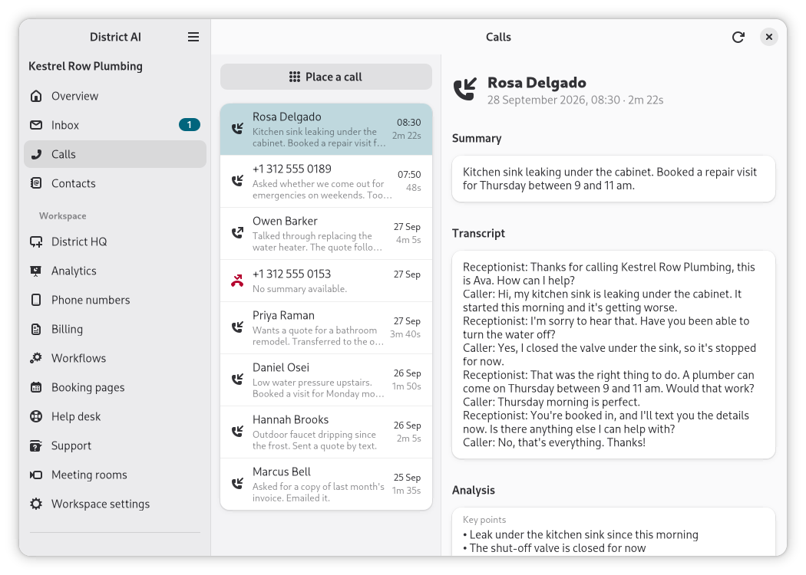
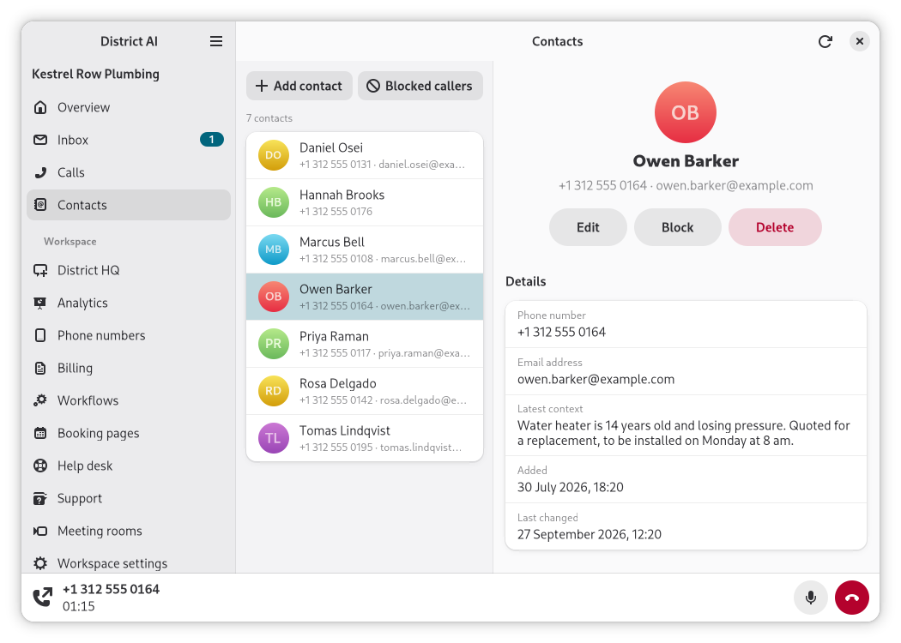

# District AI for Linux

[](https://scorecard.dev/viewer/?uri=github.com/distronode-corporation/district-linux)

A native GTK 4 and libadwaita desktop client for District AI, the AI voice
receptionist from Distronode.



> **Status: 2.1.0 is the current release**, as a .deb and a Flatpak bundle for
> x86_64, both with calls, on the
> [Releases](https://github.com/distronode-corporation/district-linux/releases/latest)
> page (see [Install](#install)). Calls on the desktop need a build with the
> `voice` feature, as both packages are; a default build from source has
> everything else, and says so where calls would be.

**Links:** [project page](https://www.distronode.com/open-source/district-linux),
[GitLab mirror](https://gitlab.com/distronode-corporation/district-linux) (read-only
mirror; issues and pull requests live on GitHub), [CHANGELOG](CHANGELOG.md).

## What it does

District AI answers a business's phone calls with an AI receptionist. This app
brings a District AI workspace to the Linux desktop:

- **Calls:** the call log, each call's summary and transcript, and calls
  updating live as they happen.
- **Inbox:** the workspace's text messages and emails, read and answered from
  the desktop, with a reply written by AI when you ask for one.
- **Contacts:** the workspace's contacts, and the callers it has blocked.
- **Calls on the desktop,** in a build with calls, as the packages are: a call
  handed to you rings on this computer, a dialler places your own without
  picking up a phone, and meeting rooms are joined the same way, audio only.
- **The rest of the workspace:** District HQ, analytics, the help desk, support
  requests, workflows, booking pages, and the phone numbers and billing, read
  only.
- **Workspace settings:** District Studio, the receptionist's settings as the
  web console groups them: Persona, Voice (recipes, the signal chain part by
  part, the time to first word and where each part is processed), Call handling
  (where it transfers calls and how calls are routed), Skills and Knowledge.
  Then the workspace's carrier accounts and members, as far as your role allows.

You need a District AI account to use it, and taking or placing calls needs a
role that allows them. See <https://www.distronode.com>.

**Without an account with us.** Today this app needs a District AI account to sign in. We
want the District AI apps to work without an account with us too. We have not worked out
what that looks like or whether it can work, and the answer depends on what people would
use them with, so we are asking before we build anything:
[tell us what you would connect them to](https://github.com/distronode-corporation/.github/discussions/1).



## Platform support

| Platform | Status |
| --- | --- |
| Linux x86_64 with GTK 4.14 and libadwaita 1.5 or newer (Ubuntu 24.04, Debian 13, and newer) | The target: a `.deb` and a Flatpak (see [Install](#install)). |
| Other Linux architectures | Not yet. |
| macOS, Windows | Not targeted. |

GTK 4.14 and libadwaita 1.5 are the floor because they are what Ubuntu 24.04
ships; Debian 13 ships newer. The Flatpak brings its own runtime (GNOME 51) and
so does not depend on the distribution's versions.

## Install

The current release is
[2.1.0](https://github.com/distronode-corporation/district-linux/releases/latest).
It carries two packages for x86_64, both with calls. Both link this project's
own build of libwebrtc for calls, which leaves out the H.264 and H.265 codecs
and FFmpeg (see [NOTICE](NOTICE)).

- **`district-ai_2.1.0-1_amd64.deb`**, for Ubuntu 24.04, Debian 13 and newer.
  Install it with apt, which also installs what it depends on:

  ```
  sudo apt install ./district-ai_2.1.0-1_amd64.deb
  ```

  It depends on GTK 4, libadwaita, GTK's media backend and the GStreamer
  plugins that play the ringtone, and the PulseAudio client library for a
  call's audio. It recommends a keyring (GNOME Keyring, KWallet or KeePassXC)
  to keep your sign-in, the desktop portals, and a PulseAudio server (PipeWire's
  `pipewire-pulse`, which most desktops already run) for calls.

- **`district-ai_2.1.0_x86_64.flatpak`**, for any distribution with Flatpak.
  It needs the Flathub remote, from which Flatpak fetches its runtime:

  ```
  flatpak remote-add --user --if-not-exists flathub https://dl.flathub.org/repo/flathub.flatpakrepo
  flatpak install --user ./district-ai_2.1.0_x86_64.flatpak
  ```

  It runs sandboxed, with the network, your display, the GPU, PulseAudio and
  logind (to know when the computer goes to sleep) and nothing else. Your
  keyring, notifications, links and files go through the desktop portals, so
  your desktop needs xdg-desktop-portal and a backend for it, as most do.

Each package comes with a signed attestation of the build that made it, which
you can check with the GitHub CLI:

```
gh attestation verify district-ai_2.1.0-1_amd64.deb --repo distronode-corporation/district-linux
```

The attestation is also attached to the release as
`district-ai_<version>.intoto.jsonl`, so you can check a download against that
file rather than GitHub's attestation store by adding
`--bundle district-ai_<version>.intoto.jsonl` to that command.

## Build from source

Requirements: Rust 1.92 or newer (via [rustup](https://rustup.rs); the repository
pins the stable channel) and the GTK 4 and libadwaita development files.

**Ubuntu 24.04 or newer, Debian 13 or newer:**

```
sudo apt-get update
sudo apt-get install -y build-essential pkg-config libgtk-4-dev libadwaita-1-dev
```

`build-essential` provides the C compiler and linker that Rust and the TLS library
need. No OpenSSL is needed: HTTPS is rustls.

Then:

```
git clone https://github.com/distronode-corporation/district-linux
cd district-linux
cargo build --release --locked
./target/release/district-ai
```

The build fetches the app's shared core,
[District AI core for Rust](https://github.com/distronode-corporation/district-core-rust),
from GitHub at the tag and commit Cargo.toml and Cargo.lock pin, as it fetches
every other crate.

That build has no calls. Building with them (the `voice` feature) links
libwebrtc and needs clang 21 or newer; [CONTRIBUTING.md](CONTRIBUTING.md#building-with-calls)
has the steps.

Signing in opens your browser, which hands the result back through a
`districtai://` link. For the browser to find the app, the desktop entry has to
be installed. The packages install it; for a build from source,
[CONTRIBUTING.md](CONTRIBUTING.md#running-the-app) says how to install it for
your user.

Without a keyring (GNOME Keyring, KeePassXC or another Secret Service), the app
works but keeps your sign-in only until it quits, and says so.

## Contributing, security and conduct

- [CONTRIBUTING.md](CONTRIBUTING.md): the layout, the local checks CI runs, and
  the commit message rule. The data types, the API client, sign-in, the
  application state and the call engine live in
  [District AI core for Rust](https://github.com/distronode-corporation/district-core-rust),
  which this app pins by tag; changes to them go there.
- [SECURITY.md](SECURITY.md): report vulnerabilities privately through
  [GitHub's private vulnerability reporting](https://github.com/distronode-corporation/district-linux/security/advisories/new),
  not in a public issue. It also describes the sign-in and token design.
- [CODE_OF_CONDUCT.md](CODE_OF_CONDUCT.md): everyone taking part is expected to
  follow it.
- [SUPPORT.md](.github/SUPPORT.md): where questions, bugs and product support go.

## License and trademarks

Apache License 2.0. See [LICENSE](LICENSE) and [NOTICE](NOTICE). Third-party
dependencies keep their own licences; NOTICE says where their texts are.

District AI, Distronode and the District AI and Distronode logos and app icons
are trademarks of Distronode Corporation. They are not licensed under the
Apache License 2.0: a build you distribute must use its own name, icon and
identifier.

This project is not affiliated with or endorsed by LiveKit, the GNOME project
or Flathub.
